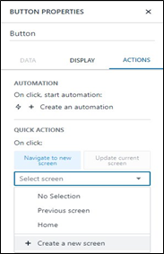
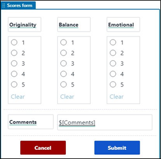

# Honeycode App Build Guide

1.	To build the scoring app in HoneyCode, first sign in and choose Create Workbook.
2.	Import our .csv table definitions into the workbook. 
3.	Because each table is imported into the workbook, be sure to rename each table according to its filename (such as Scores and Composers), and click through each column in the tables to apply formulas and filters, as shown in the following screenshot.

4.	After the tables are created, choose the Builder icon in the sidebar and then the plus sign to create a new app.

We recommend setting the first screen to be the home screen that navigates users to either the score input form, or the current standings by choosing a button.

5.	For each button, choose it to bring up the button’s property panel on the right side of the screen.
6.	Choose Actions and for On click, choose Navigate to new screen.
7.	On the drop-down menu, choose Create a new screen.

8.	Choose the new screen and navigate to the Add score screen.
9.	Add a picklist to allow users to select a specific composer and radio buttons to select the competition round.

While configuring the input fields, make sure to rename each input accordingly, as shown in the following screenshots.

10.	Next, add a new form object to the screen and configure it to be placed into the current screen, to add form data to the scores tables, and display the fields Originality, Balance, Emotional, and Comments—our scoring criteria.

11.	For each scoring field in the new form, choose the corresponding content box and add a radio button object and delete the old context box. 
12.	For each radio button, configure it as shown in the following screenshot and rename it according to which scoring field it’s recording a value for.

13.	After configuring the radio buttons, we recommend optionally resizing some of the input fields and rearranging them to fit more neatly into the screen.

14.	Choose Submit.
15.	Navigate to the Actions panel and choose Edit automation

16.	Confirm that each data field is configured correctly to take the right input and write it to the correct column. 

17.	We additionally use the $SYS_USER local variable to record which user added this score.

18.	Choose Scores form to pull up its property panel.

19.	Modify its visibility such that it only appears if the user has selected both a composer to score and the round the score is for.

20.	To configure the Score Board screen, choose it in the Screens panel.
21.	On the empty screen, rename the header to say “Score Board.”

22.	Add a new column list to the empty section, selecting the source to be the composers table.

23.	In the column list on the screen, choose Composers List to bring up its properties.

24.	Modify the data source to be the following filter to only show composers with at least one recorded score:

`=FILTER(Composers,"Composers[Display Preliminary]=TRUE ORDER BY Composers[Aggregated Overall Score] DESC")`

As scores come in, the participants will be eager to see how their compositions measure up to their peers, and we recommend building a leaderboard website separate from your scoring tool to provide live updates as your judges submit their scores. To service this, we hosted a simple static HTML page out of an Amazon Simple Storage Service (Amazon S3) bucket that used JavaScript and DataTables to query the scoring tool and display the scores in a live and searchable scoreboard. To query the submitted scores, we wrote a simple AWS Lambda function to pull the data directly out of HoneyCode using its QueryTableRows API function, and exposed it as an API endpoint via Amazon API Gateway.
